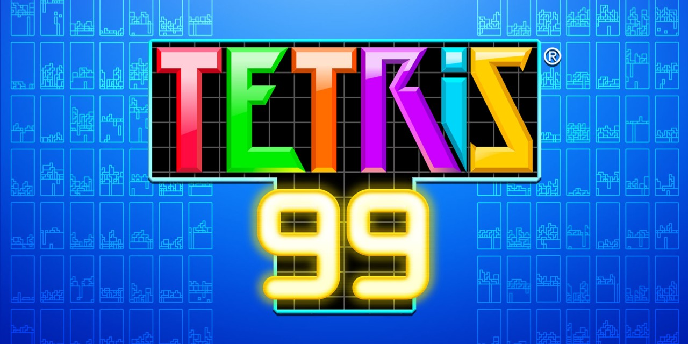

# Game idee: Tetris

## 💡Tetris
Je moet proberen zo veel mogelijk horizontale lijnen te maken.

## Controls: 
- Pijltje omhoog = Object draaien
- Pijtlje naar links = Draai het object naar links
- Pijtlje naar rechts = Draai het object naar rechts
- Spatie = Object snel plaatsen 

## Doel van het spel
Je bestuurd een controller die probeerd zoveel mogelijk horizontale lijnen te maken.
Maar er zijn ook gevaren je moet proberen niet tegen het dak aan te komen want dan ben je af en kan je het opnieuw proberen.

## Game mechanics
- Play button
- Verschillende controls
- Draaibare objecten

##